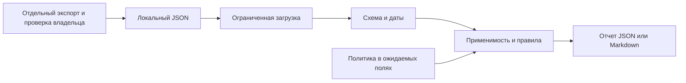

# Архитектура автономного аудитора Hyper-V

## Назначение и реальные компоненты

Продукт оценивает предоставленные сведения, не подключается к инфраструктуре и не исправляет настройки. Команда `hyperv-opsec-auditor` вызывает `hyperv_opsec_auditor.cli:main`. При `validate` выполняются загрузка и проверка структуры; `rules` выводит реестр; `audit` добавляет оценку и отчет.

| Компонент | Файл | Ответственность |
|---|---|---|
| CLI | `src/hyperv_opsec_auditor/cli.py` | Параметры, русский UTF-8, коды завершения, исключительная запись нового файла |
| Вход | `validation.py`, `evidence.schema.json` | Лимит 2 MiB, JSON без повторных ключей, схема, даты, уникальные идентификаторы |
| Правила | `rules.py` | Детерминированная оценка HV-01..HV-10, состояние сбора, применимость и актуальность |
| Отчет | `reporting.py` | JSON и Markdown с экранированием; рекомендации не исполняются |
| Упаковка | `tools/build_release.py`, `tools/package_smoke.py` | wheel/sdist, контрольные суммы, чистая установка и пересборка |

## Поток данных и границы

Предоставленный JSON недоверенный. Владелец отдельно подтверждает поддерживаемость, эффективные права, топологию и восстановление; схема не устанавливает истинность. Устаревшие или будущие данные не оцениваются как успешные. Ошибка структуры прекращает аудит; отсутствующий раздел, ошибка сбора и исключение остаются видны.

Нет базы данных, сервера HTTP, удаленных плагинов, загрузки команд из JSON, фоновых процессов или сборщика Windows. Записывается только запрошенный новый отчет. Сетевые вызовы сборки/публикации относятся к инструментам разработки, не к обработчику аудита.

## Расширение и ограничения

Новый источник/правило требует изменения схемы, реестра и оценщика с проверкой совместимости, тестами и матрицей. Поддержка хоста и параметры политики не выводятся автоматически. Будущий сборщик PowerShell требует отдельной лабораторной приемки только чтения. [Подробная архитектура](docs/architecture.md), [контракт](CORE-CONTRACT.md), [угрозы](THREAT-MODEL.md).
