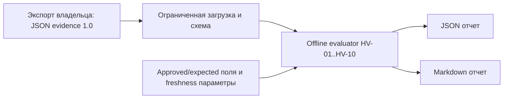

# Архитектура MVP

Пакет `hyperv_opsec_auditor`: validation.py (2 MiB, strict JSON, bundled schema, timestamps/IDs), rules.py (чистые функции без I/O), reporting.py (экспорт), cli.py (argparse и файловый I/O). Никаких Hyper-V/WinRM подключений и credentials. Writes ограничены запрошенными отчетами; вход не изменяется.

Evidence envelope: schema_version=1.0, synthetic, scope псевдоним, collected_at UTC, evidence_source, необязательные разделы host/administration/winrm/network/virtual_machines/storage/backup/logging/recovery. Section state: ok/error/not_collected. Значения null/отсутствие означают неизвестность. Поля approved/expected/require — декларации политики владельца, не независимо проверенные факты. Inventory IDs уникальны. [Подробный контракт](input-contract.md).

Порядок: validate → freshness → section state → applicability → требуемые evidence → сравнение. Подтвержденное нарушение дает fail даже при иных неизвестных полях; pass требует всех доказательств правила. Stale/future evidence дает unknown до сравнения. Not_run отдельно от unknown. Генерация 1 и неподдерживаемый профиль VM не считаются успешной проверкой Secure Boot/защиты. vTPM не заменяет shielding; shielding требует отдельно shielded/key protector/HGS evidence.

Report: schema_version, tool_version, policy_version, as_of, collected_at, synthetic, scope, freshness параметры, limitation list, coverage/counts и findings. Findings содержат rule_id, asset, severity, status, rationale, evidence с JSON pointers и ожидаемыми значениями, remediation текст. Рекомендации не исполняются. Отчет не включает весь input. Выводы по AD rights, storage ACL, network isolation, support и restore опираются на external reviewed evidence, а не вычисляются по реальным API.

Live PowerShell collector, signed evidence и remote WinRM остаются следующими этапами ADR. Их read-only свойства должны проверяться на Windows сравнением состояния до/после. Linux и Windows hosted CI тестируют только offline Python workflow, без Hyper-V роли.
