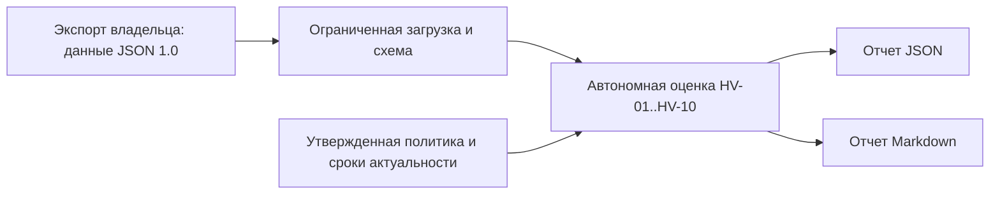

# Архитектура MVP

Пакет `hyperv_opsec_auditor`: `validation.py` — строгий JSON до 2 MiB, встроенная схема, даты и идентификаторы; `rules.py` — чистые функции без ввода-вывода; `reporting.py` — экспорт; `cli.py` — `argparse` и файловый ввод-вывод. Нет подключений Hyper-V/WinRM и учетных данных. Запись ограничена запрошенным отчетом; вход не изменяется.

Оболочка данных: `schema_version=1.0`, `synthetic`, псевдоним `scope`, `collected_at` UTC, `evidence_source`; необязательные разделы `host`/`administration`/`winrm`/`network`/`virtual_machines`/`storage`/`backup`/`logging`/`recovery`. Поле `state`: `ok`/`error`/`not_collected`. `null` и отсутствие означают неизвестность. Ожидаемые/утвержденные/обязательные поля — политика владельца, не независимо проверенные факты. Идентификаторы объектов уникальны. [Контракт](input-contract.md).

Порядок: проверка структуры → актуальность → состояние сбора → применимость → необходимые данные → сравнение. Подтвержденное нарушение дает `fail` даже при иных неизвестных полях; `pass` требует всех свидетельств правила. Устаревшие/будущие данные дают `unknown` до сравнения. `not_run` отличается от `unknown`. Gen1 и неподдерживаемые VM не считаются успешно проверенными для Secure Boot/защиты. vTPM не заменяет Shielded VM: нужны отдельные данные `shielded`, защитников ключей и HGS.

Отчет: `schema_version`, `tool_version`, `policy_version`, `as_of`, `collected_at`, `synthetic`, `scope`, параметры актуальности, ограничения, счетчики и `findings`. Каждый результат содержит `rule_id`, `asset`, `severity`, `status`, `rationale`, `evidence` с указателями JSON/ожидаемыми значениями и текст `remediation`. Рекомендации не исполняются. Полный вход не включается. Выводы по правам AD, ACL хранилища, сети, поддержке и восстановлению опираются на отдельно проверенные сведения владельца, не на реальные API.

Сборщик PowerShell, подписи данных и удаленный WinRM отложены. Их свойства чтения проверяются на Windows сравнением состояния до/после. CI Linux/Windows тестирует только автономный Python без роли Hyper-V. Русский текст выводится в UTF-8; ключи JSON и машинные значения не переводятся.
